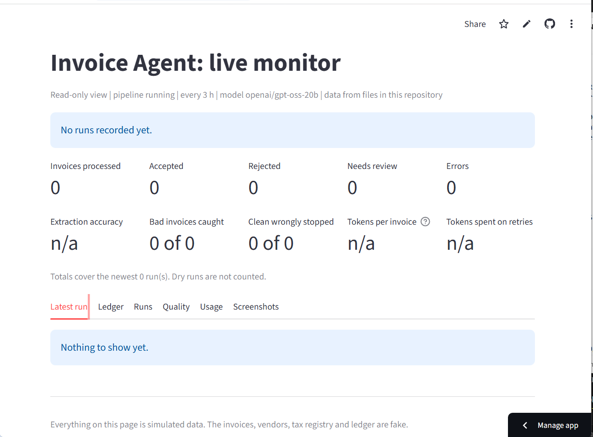
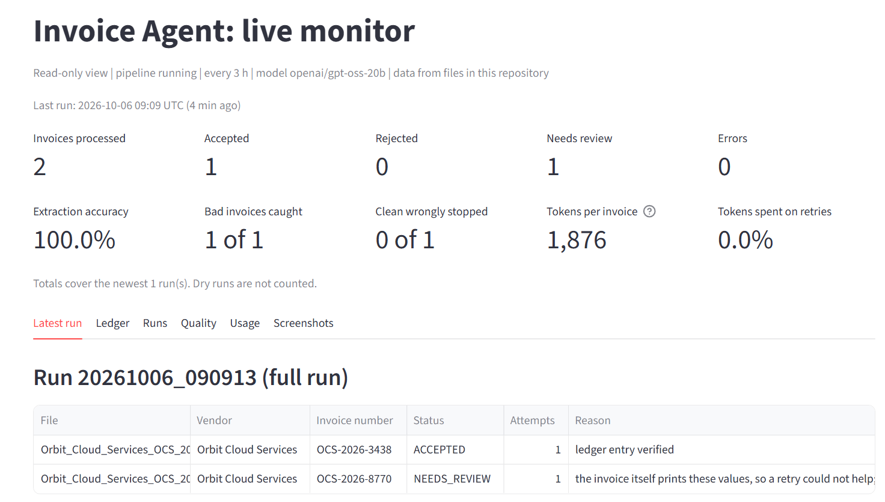
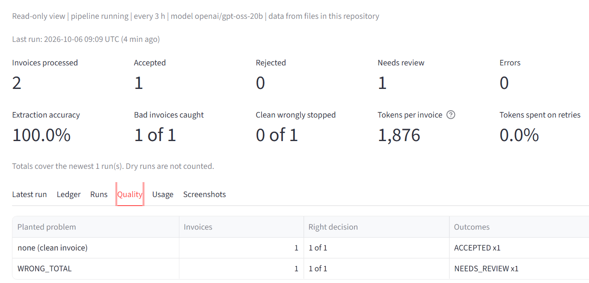
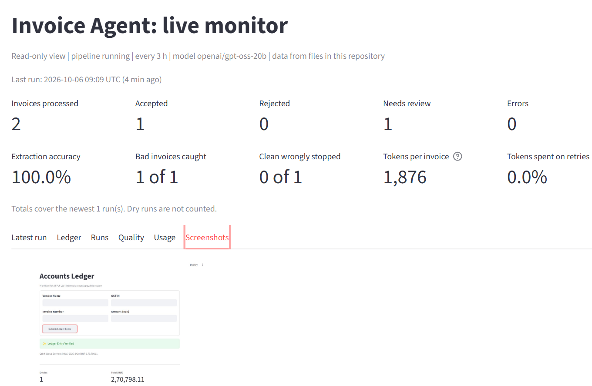
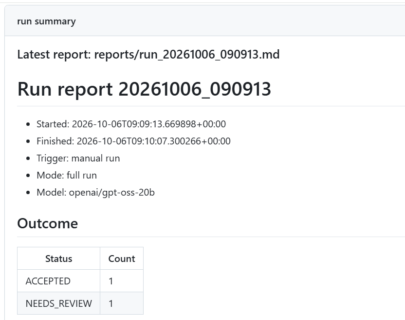
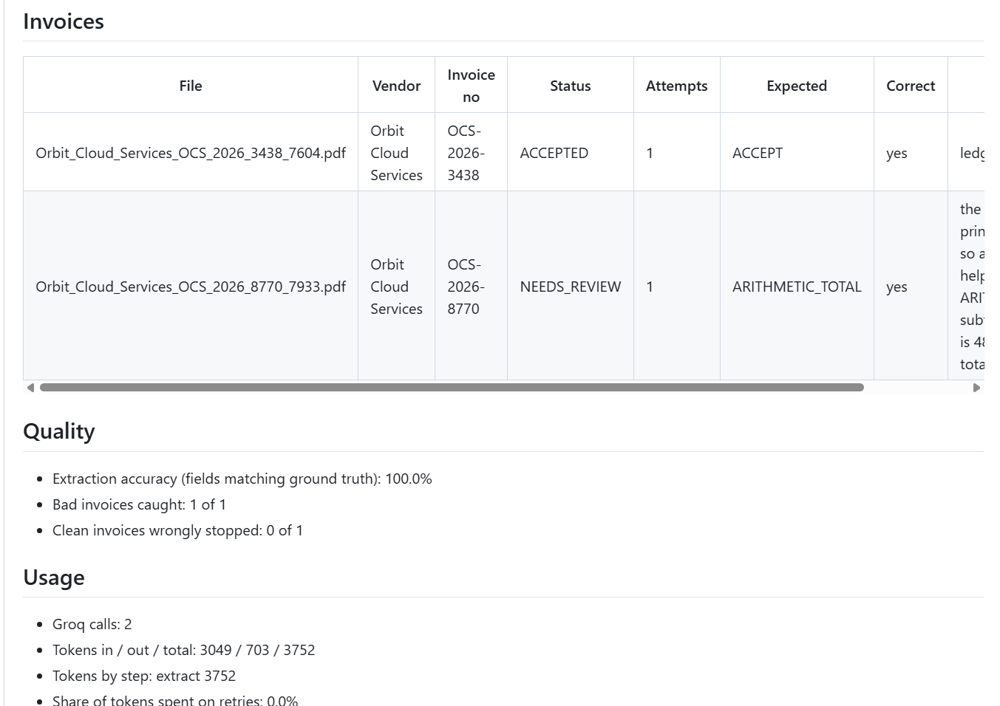
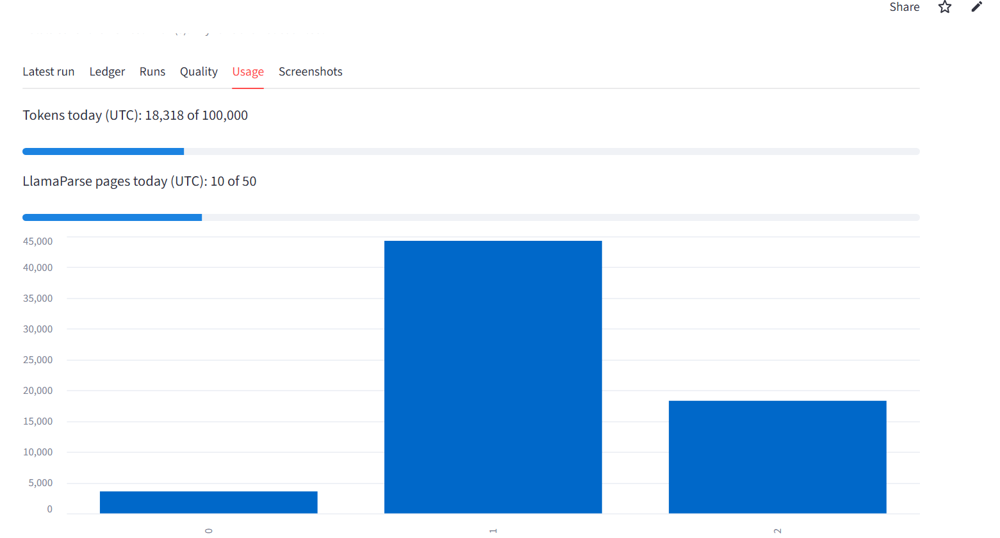

**[Open the live app](https://automated-invoice-agent-sk.streamlit.app/)**

## Output Gallery

<table width="100%">
  <!-- Row 1: Execution States -->
  <tr>
    <td align="center" valign="top" width="50%">
      
       
      <strong>1. Pre-Run Environment State</strong>
    </td>
    <td align="center" valign="top" width="50%">
      
       
      <strong>2. Post-Run Execution Output</strong>
    </td>
  </tr>
  
  <!-- Row 2: Decision Log & Main Preview -->
  <tr>
    <td align="center" valign="top" width="50%">
      
       
      <strong>3. Agent Decision & Branching Logic</strong>
    </td>
    <td align="center" valign="top" width="50%">
      
       
      <strong>4. Core System Interface Preview</strong>
    </td>
  </tr>
  
  <!-- Row 3: Summaries & Metrics -->
  <tr>
    <td align="center" valign="top" width="50%">
      <!-- Assuming full name ends with -1.png based on pattern -->
      
       
      <strong>5. Run Summary Metrics (Part 1)</strong>
    </td>
    <td align="center" valign="top" width="50%">
      <!-- Assuming full name ends with -2.png based on pattern -->
      
       
      <strong>6. Run Summary Metrics (Part 2)</strong>
    </td>
  </tr>

  <!-- Row 4: Telemetry (Centered Bottom Row) -->
  <tr>
    <td align="center" valign="top" colspan="2" width="100%">
      <!-- Assuming full name ends with -usage.png based on pattern -->
      
       
      <strong>7. LLM Token Usage & Cost Telemetry</strong>
    </td>
  </tr>
</table>
